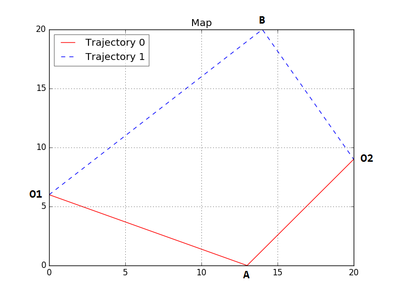
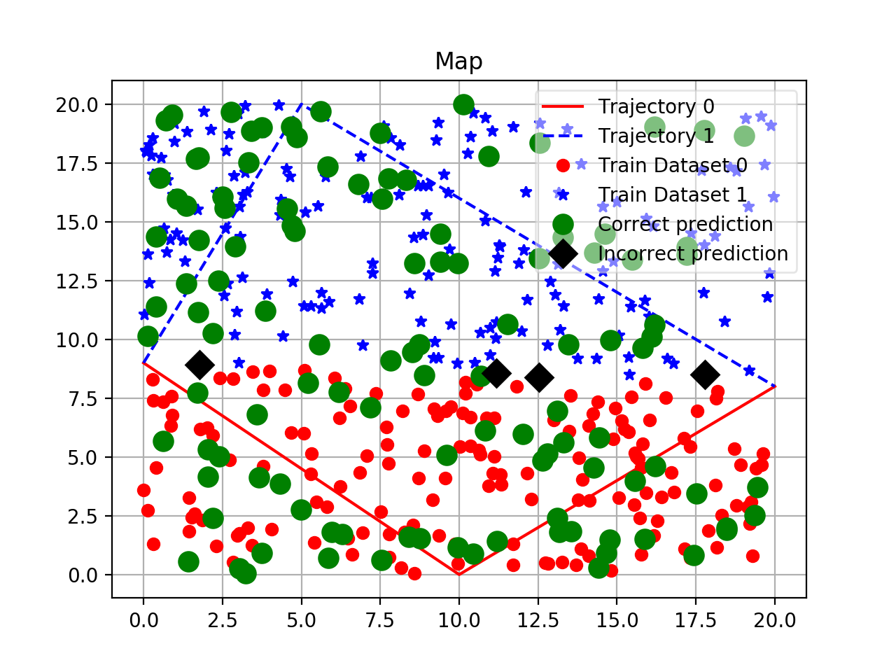
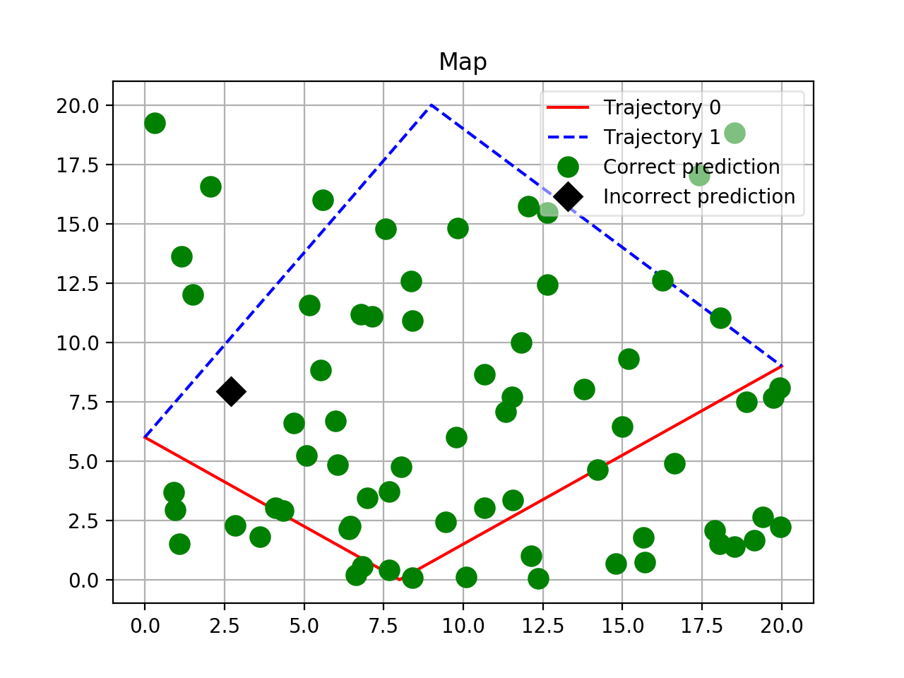

# Neural Network based UAV Routing

Implementation of Multi-Layered Neural Network with Back Propagation.

## Problem

Neural network should select the nearest trajectory depending on the current UAV position.



## Features

- Multi-Layered Neural Network;
- Training using Back-Propagation method;
- Bias neurons;
- Map generation;
- Dataset generation using [Triangle Point Picking](http://mathworld.wolfram.com/TrianglePointPicking.htm) method;
- Visualization of the neural network's output.

## Usage

```
python main.py [-h] [-b] [-i HIDDEN_LAYERS] [-j LAYER_NEURONS] [-t]
               [-e EPOCHS] [-a ALPHA] [-x TRAIN_SPEED] [-s SEED] [-l] [-p]
               [-n PLOT_NAME] [-v]

optional arguments:
  -h, --help            show this help message and exit
  -b, --bias            use bias neuron in hidden layer
  -i HIDDEN_LAYERS, --hidden-layers HIDDEN_LAYERS
                        number of hidden layers
  -j LAYER_NEURONS, --layer-neurons LAYER_NEURONS
                        number of neurons in hidden layers
  -t, --train           perform training
  -e EPOCHS, --epochs EPOCHS
                        train with specified number of epochs
  -a ALPHA, --alpha ALPHA
                        gradient descent momentum
  -x TRAIN_SPEED, --train-speed TRAIN_SPEED
                        gradient descent train speed
  -s SEED, --seed SEED  seed random generator
  -l, --logging         write training process into training.log file
  -p, --plotting        show plot
  -n PLOT_NAME, --plot-name PLOT_NAME
                        plot name
  -v, --verbose         verbose output
```

### Example

**I. Training**

`python main.py -b -p -t -s 100`

Using the above arguments the following neural network will be created:

```
(i)  (h)
     (h)  (o)
(i)  (h)

(b)  (b)
```
where:

* (i) - input
* (b) - bias
* (h) - hidden
* (o) - output

By default training takes 1000 epochs.

The result will be displayed on a plot, which contains: trajectories, training datasets, correct predictions and fails.



**II. Predicting**

`python main.py -b -p -s 78`

Neural network will reuse calculated at previous step weights: `weights_0.w.txt, weights_1.w.txt, weights_bias_0.w.txt, weights__bias_1.w.txt`.



Omitting `-s` flag will result to randomly generated trajectories and datasets.

**III. More layers**

`python main.py -b -p -i 5 -j 10 -t -e 5000 -s 114`

The above command generates Neural Network with bias neurons, 5 hidden layers and 10 neurons per hidden layer. Training will take 5000 epochs.

To save plot add: `--plot-name plot.png`.

## Requirements

* `Python 2.7`
* `NumPy`
* `MatplotLib`

---

## License

The source code is published on the terms of [MIT License](https://choosealicense.com/licenses/mit/#).